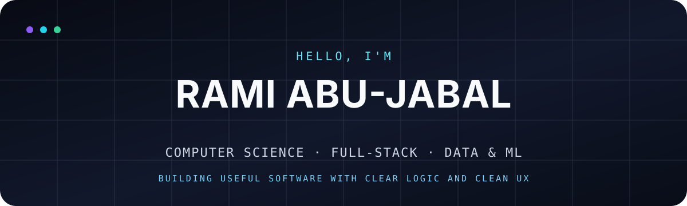

<div align="center">
  

  <br />

  <a href="[https://my-portfolio-xi-wine-53.vercel.app](https://ramiscs.vercel.app/)"></a>
  <a href="https://www.linkedin.com/in/rami-abu-jabal-b52374287/"></a>
  <a href="mailto:ramiabujabal22@gmail.com"></a>
</div>

## About me

I'm a **B.Sc. Computer Science student** who enjoys turning ideas into practical, well-designed software. My work spans **full-stack development, data, and machine learning**, backed by strong CS fundamentals and a bias toward learning by building.

- 🔭 Building real products with thoughtful UX and maintainable code
- 🌱 Deepening my skills in modern web development, data, and ML
- 🤝 Comfortable collaborating, sharing feedback, and solving problems as a team
- 💼 Open to internships, junior roles, and interesting collaborations
- 📍 Based in Israel · Remote friendly

## Featured work

<table>
  <tr>
    <td width="50%" valign="top">
      <h3>Portfolio</h3>
      <p>A fast, responsive personal site that presents my background, skills, and project work through a clean interactive experience.</p>
      <p><strong>Next.js · React · TypeScript · Tailwind CSS · Framer Motion</strong></p>
      <a href="https://ramiscs.vercel.app/#about">Live site</a> · <a href="https://github.com/RamiiAjj/my-portfolio">Source</a>
    </td>
    <td width="50%" valign="top">
      <h3>MIGAL DSS</h3>
      <p>A decision-support system project combining software engineering with data-focused problem solving and an applied product mindset.</p>
      <p><strong>Data · Machine Learning · Decision Support</strong></p>
    </td>
  </tr>
  <tr>
    <td width="50%" valign="top">
      <h3>Linux Course Project</h3>
      <p>A practical course project focused on Linux workflows, scripting, automation, and working confidently from the command line.</p>
      <p><strong>Python · Linux · Shell</strong></p>
      <a href="https://github.com/RamiiAjj/Final_LINUX_Course_Project">View repository</a>
    </td>
    <td width="50%" valign="top">
      <h3>Web Development</h3>
      <p>A growing collection of hands-on frontend work exploring browser fundamentals and interactive web experiences.</p>
      <p><strong>JavaScript · HTML · CSS</strong></p>
      <a href="https://github.com/RamiiAjj/webb">View repository</a>
    </td>
  </tr>
</table>

## Tech stack

<div align="center">

| Area | Technologies |
|:--|:--|
| **Languages** |      |
| **Frontend** |    |
| **Tools** |    |

</div>

## GitHub snapshot

<div align="center">
  
  
</div>

## Current focus

```text
Building      polished full-stack applications
Exploring     data-driven products and machine learning
Improving     system design, testing, and production workflows
Looking for   a team where I can contribute, learn, and grow
```

---

<div align="center">
  <strong>Have an opportunity or an idea worth building?</strong><br />
  <a href="mailto:ramiabujabal22@gmail.com">Email me</a> · <a href="https://www.linkedin.com/in/rami-abu-jabal-b52374287/">Connect on LinkedIn</a> · <a href="https://github.com/RamiiAjj?tab=repositories">Explore my repositories</a>
</div>
